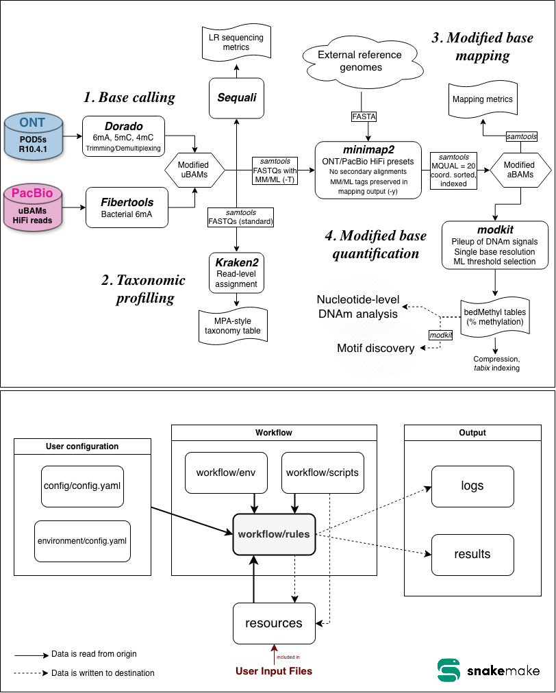

# methbiome


<center>Bioinformatic pipeline for reference-guided epigenetic analysis of long-read microbiomes. <em>methbiome</em> reads in electrical signal data from ONT stored in POD5 files alongside kinetic feature data from PacBio HiFi reads in BAM format. <em>methbiome</em> performs <em>1)</em> base calling and data quality assessment, <em>2)</em> taxonomic profiling, <em>3)</em> modified base mapping, and <em>4)</em> modified base quantification. <em>methbiome</em>'s reference-guided approach quantifies DNA methylation within a stable, accurate coordinate system, enabling robust epigenetic profilling across loci, samples, and studies, and supporting downstream meta-epigenome-wide association and methylation motif analyses. <em>methbiome</em> was implemented in <em>Snakemake</em>.   </center>
<br><br>



<br><br>

## Table of Contents

- [methbiome](#methbiome)
  - [Table of Contents](#table-of-contents)
  - [I. Environment Dependencies](#i-environment-dependencies)
    - [A. SLURM Profile](#a-slurm-profile)
    - [B. CUDA](#b-cuda)
    - [C. Dorado for Linux x64](#c-dorado-for-linux-x64)
  - [II. Set Up](#ii-set-up)
    - [A. Miniforge](#a-miniforge)
    - [B. Snakemake](#b-snakemake)
    - [C. Slurm Plugin](#c-slurm-plugin)
  - [III. Usage](#iii-usage)
    - [A. Download methbiome](#a-download-methbiome)
    - [B. Configuration](#b-configuration)
    - [C. Pipeline Execution](#c-pipeline-execution)
      - [1. Parallel Processing Set Up](#1-parallel-processing-set-up)
      - [2. Execution of the Entire Pipeline](#2-execution-of-the-entire-pipeline)
      - [4. Execution of Part of the Pipeline](#4-execution-of-part-of-the-pipeline)
    - [D. Post-scripts](#d-post-scripts)
      - [1. Combine Sequali Reports into MultiQC](#1-combine-sequali-reports-into-multiqc)
      - [2. Combine MPA reports](#2-combine-mpa-reports)


## I. Environment Dependencies

### A. SLURM Profile

This pipeline was built for execution with SLURM but can be easily adapted to other environments. To do so, you can edit [`environment/config.yaml`](environment/config.yaml).

### B. CUDA

Basecalling with Dorado relies on CUDA, which is loaded by the command `module load cuda`. You might need to change this command.

### C. Dorado for Linux x64

In this project, the Dorado version we use is for Linux x64. For other environments, change the download link in the `install_dorado` rule.

## II. Set Up

### A. Miniforge

Install [miniforge](https://conda-forge.org/download).

### B. Snakemake

See [Snakemake installation](https://snakemake.readthedocs.io/en/stable/getting_started/installation.html).

### C. Slurm Plugin

```bash
pip install snakemake-executor-plugin-slurm
```

## III. Usage

### A. Download methbiome

```bash
git clone https://github.com/ricardocosteira/methbiome
```

### B. Configuration

- Place each ONT or PacBio sample in a subdirectory in `resources/data`. Please avoid naming it with spaces and special characters (other than '-' and '_').
- For each sample you want to process make a copy of [`config/config.yaml`](config/config.yaml) in `config/` and set any relevant parameters.
- For environment specific configuration like job resources, edit [`environment/config.yaml`](environment/config.yaml).

### C. Pipeline Execution

#### 1. Parallel Processing Set Up

Dependencies have to be installed first for parallel processing of samples. This has to be done before processing any sample!

```bash
snakemake setup --profile environment --configfile config/config.yaml
```


#### 2. Execution of the Entire Pipeline

For each sample follow these steps.

Open a tmux session so that Snakemake can continue running in the background. Then, run the following command with the relevant configuration file.

```bash
snakemake --profile environment --configfile config/sample1_config.yaml
```

#### 4. Execution of Part of the Pipeline

Open a tmux session so that Snakemake can continue running in the background. Then, replace `rule_name` in the following command and run it.

This will run the pipeline up to the rule named `rule_name`, meaning that all rules on which `rule_name` depends are also executed.

```bash
snakemake rule_name --profile environment --configfile config/sample1_config.yaml
```

### D. Post-scripts

This is useful if you want to combine data from multiple samples.

Make sure you are in the `post-scripts` directory.

```bash
cd post-scripts
```

#### 1. Combine Sequali Reports into MultiQC

Run the following command, where `<directory1>`, `<directory2>`, ... are directories containing Sequali reports.

```bash
./combine_sequali_into_multiqc.sh <directory1> <directory2> <directoryn>
```

#### 2. Combine MPA reports

Run the following command, where `<directory1>`, `<directory2>`, ... are directories containing kraken2 MPA reports.

```bash
./combine_mpas.sh <directory1> <directory2> <directoryn>
```

<br>

The pipeline was tested using publicly available data for the ZymoBIOMICS D6323 fecal microbiome standard. ONT POD5s available at https://epi2me.nanoporetech.com/zymo_fecal_2025.05/. PacBio BAMs available at https://www.pacb.com/connect/datasets/.
